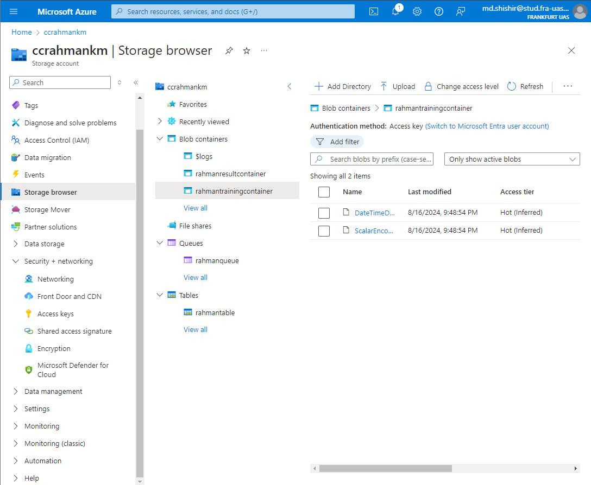

# ML23/24-06 Bitmap Representation of Sparse Distributed Representations (SDRs) - Azure Cloud Implementation
## Introduction
In the world of data science and machine learning, Sparse Distributed Representations (SDRs) are a powerful way to encode and represent information. But turning these SDRs into visual formats, like bitmaps, can be a complex process. To make this easier for others to understand and use, our project, "Improving Documentation of SDR to Bitmap," was born.

The goal was simple: make it easier for people to grasp how SDRs are converted into bitmaps. This involved not just improving the documentation, but also enhancing how these methods are implemented and used. We realized that clear, accessible documentation is essential for anyone who wants to work with SDRs, especially those who might not be experts in the field.

We took advantage of the cloud’s ability to scale and provide easy access to powerful computing resources. This means that now, instead of needing high-end hardware to run these processes, anyone can do it from virtually anywhere, using the cloud. This is especially useful when working with large datasets or complex visualizations that require more processing power.

Moreover, I uploaded SDRs to a training container in the cloud. So now, users can easily access, train, and visualize their data directly in the cloud, making the workflow smoother and more efficient.

## Recap (Software Engineering Project)
If you need to obtain a copy of our project on your own system, use these links in order to carry out development and testing. Look at the notes on how to deploy the project and experiment with it on a live system. These are the relevant links:

- Project Documentation: [Documentation](https://github.com/RahmanKM/neocortexapi/blob/master/source/MySEProject/Documentation/ML_23-24-06_Improve_Samples_and_Documentation_for_SDR_representation_SDR-to-Bitmap-TeamKT.pdf)  

## What is this experiment about
In this experiment we have implemented our Software Engineering project in Azure cloud. Below is the total algorithm of the project:


## Information about our Azure accounts and their components

|  |  |  |
| --- | --- | --- |
| Resource Group | ```RG-Rahman-Khan``` | --- |
| Container Registry | ```rahmankmc``` | --- |
| Container Registry server | ```rahmankmc.azurecr.io``` | --- |
| Container Instance | ```rahmankm3rd``` | --- |
| Storage account | ```ccrahmankm``` | --- |
| Queue storage | ```rahmanqueue``` | Queue which containes trigger message |
| Training container | ```rahmantrainingcontainer``` | Container used to store training data|
| Result container | ```rahmanresultcontainer``` | Container used to store result data|
| Table storage | ```rahmantable``` | Table used to store all output datas and results |

The experiment Docker image can be pulled from the Azure Container Registry using the instructions below.
~~~
docker login rahmankm.azurecr.io -u rahmankmc -p VUzpuJyxzCkdY+gktuALRAYxp6sfPpGVfSPVlR7OSo+ACRDYM1TB
~~~
~~~
docker pull rahmankmc.azurecr.io/mycloudproject:tag-rahmankm
~~~

## How to run the experiment
## Step1 : Message input from azure portal
add a message to queues inside Azure storage account.
p.s Uncheck "Encode the message body in Base64"

**How to add message :** 

Azure portal > Home > RG-Rahman-Khan | Queues > rahmanqueue> Add message


### Queue Message that will trigger the experiment:
~~~json
{
  "ExperimentId": "1",
  "InputFile": "runccproject",
  "Description": "SDR to Bitmap",
  "ProjectName": "ML23/24-06. Improve samples and documentation for SDR representation",
  "GroupName": "rahmanKM",
  "Students": [ "Rahman Shahriar Khan" ],
  "DateTimeDataRow": "DateTimeDataRow.json",
  "ScalarEncoderAQI": "ScalarEncoderAQI.json"
}
~~~

Go to "rahmankm3rd ," "Containers," and "logs" to make sure the experiment is being run from a container instance. 


when the experiment  is successful bellow message(Experiment complete successfully) will be shown. Experiment successfully


## Step2: Describe the Experiment Training Input Container

Before the experiments are starting, the input files are stored in ```rahmantrainingcontainer``` 

After the queue message received, this files are read from the container and the project is started.



## Step3: Describe the Experiment Result Output Container

after the experiments are completed, the result file is stored in Azure storage blob containers 


the result data are also subsequently uploaded into a database table named "teamastable"


