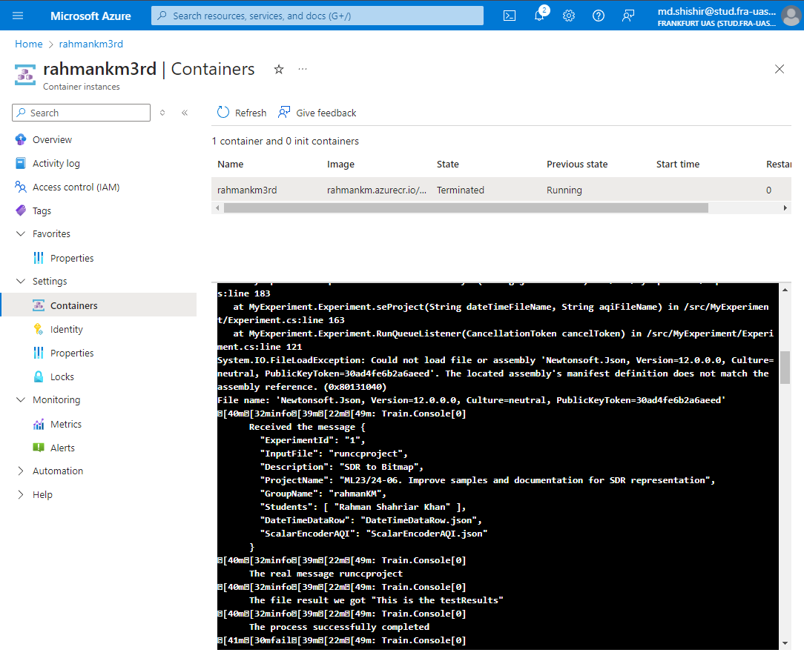

# ML23/24-06 Bitmap Representation of Sparse Distributed Representations (SDRs) - Azure Cloud Implementation
## Introduction
In the world of data science and machine learning, Sparse Distributed Representations (SDRs) are a powerful way to encode and represent information. But turning these SDRs into visual formats, like bitmaps, can be a complex process. To make this easier for others to understand and use, our project, "Improving Documentation of SDR to Bitmap," was born.

The goal was simple: make it easier for people to grasp how SDRs are converted into bitmaps. This involved not just improving the documentation, but also enhancing how these methods are implemented and used. We realized that clear, accessible documentation is essential for anyone who wants to work with SDRs, especially those who might not be experts in the field.

I took advantage of the cloud’s ability to scale and provide easy access to powerful computing resources. This means that now, instead of needing high-end hardware to run these processes, anyone can do it from virtually anywhere, using the cloud. This is especially useful when working with large datasets or complex visualizations that require more processing power.

Moreover, I uploaded SDRs to a training container in the cloud. So now, users can easily access, train, and visualize their data directly in the cloud, making the workflow smoother and more efficient.

## Recap (Software Engineering Project)
If you need to obtain a copy of our project on your own system, use these links in order to carry out development and testing. Look at the notes on how to deploy the project and experiment with it on a live system. These are the relevant links:

- Project Documentation: [Documentation](https://github.com/RahmanKM/neocortexapi/blob/master/source/MySEProject/Documentation/ML_23-24-06_Improve_Samples_and_Documentation_for_SDR_representation_SDR-to-Bitmap-TeamKT.pdf)  

## What is this experiment about
This project explores the necessity and methodology of adapting the Spatial Distributed Representation (SDR) to Bitmap conversion methods to function optimally in cloud environments. This adaptation is crucial for leveraging scalable cloud resources to handle intensive computational tasks more efficiently.

## Goal of this project:
Running SDR to Bitmap conversions on local machines limits the scalability and efficiency of processing large datasets. By migrating these operations to the cloud, I harnessed the power of distributed computing, leading to faster processing times and reduced local resource consumption. Now I can upload large number of sdrs and values and create sdrs and bitmaps based on my need and can save them for future processing purpose.

## Methodology

### Stream-Based File Handling
Originally, my methods involved direct file handling, which was not optimal for cloud-based execution. I transitioned to stream-based processing to enhance flexibility and performance. This change facilitates direct interactions with cloud storage without the need for intermediate storage, reducing I/O overhead. The changes were made to all the methods of ```SdrToBitmap``` class for generating memorystreams rather than saving file in storage. Here you can find the [codebase](https://github.com/RahmanKM/neocortexapi/blob/c4973d55f5095f98da56f1983b4b3a48e67c8155/source/MyCloudProjectSample/MyExperiment/SEProject/SdrToBitmap.cs#L17) and below is one of the method modification example:

#### Modified Method Example

```csharp
public byte[] EncodeFullDateTimeTest(int w, double r, Object input, int[] expectedOutput) {
    // Initializations and encoder settings
    var encoder = new DateTimeEncoder(getFullEncoderSettings(), DateTimeEncoder.Precision.Days);
    var result = encoder.Encode(DateTimeOffset.Parse(input.ToString()));

    // Handling 2D drawing limitation
    if ((result.Length % 2) != 0)
        throw new ArgumentException("Only odd number of bits is allowed.");

    // Stream-based bitmap generation
    using (MemoryStream memoryStream = new MemoryStream()) {
        DrawBitmap(result, memoryStream);
        return memoryStream.ToArray();
    }
} 

```

I used memorystream to hold the temprarily before uploading to cloud 
```csharp
// Utilizing MemoryStream to hold data temporarily
using (MemoryStream memoryStream = new MemoryStream()) {
    // Drawing the bitmap directly into the memory stream
    NeoCortexUtils1.DrawBitmap(twoDimArray, 1024, 1024, memoryStream, Color.Black, Color.Yellow);
    // Converting the memory stream to an array for further use
    return memoryStream.ToArray();
}
```

A override method ```DrawBitmaps``` [source](https://github.com/RahmanKM/neocortexapi/blob/c4973d55f5095f98da56f1983b4b3a48e67c8155/source/MyCloudProjectSample/MyExperiment/SEProject/NeoCortexUtils1.cs#L132) was introduced to handle such kind of BitMap generation task in `memoryStream` format in the ```NeoCortexUtils1``` class additional to the existing class methods. 

```csharp
/// <summary>
        /// Draws bitmaps from a list of 2D arrays and returns the byte array of the combined bitmap.
        /// Allows specifying bitmap dimensions and colors for active and inactive cells.
        /// </summary>
        public static byte[] DrawBitmaps(List<int[,]> twoDimArrays, int bmpWidth, int bmpHeight, Color inactiveCellColor, Color activeCellColor)
        {
            Bitmap bitmap = new Bitmap(bmpWidth, bmpHeight);
            using (Graphics g = Graphics.FromImage(bitmap))
            {
                g.Clear(inactiveCellColor);
                int offsetX = 0;

                foreach (int[,] array in twoDimArrays)
                {
                    int arrayWidth = array.GetLength(0);
                    int arrayHeight = array.GetLength(1);
                    int scaleW = bmpWidth / twoDimArrays.Count / arrayWidth;
                    int scaleH = bmpHeight / arrayHeight;

                    for (int y = 0; y < arrayHeight; y++)
                    {
                        for (int x = 0; x < arrayWidth; x++)
                        {
                            Color color = array[x, y] == 1 ? activeCellColor : inactiveCellColor;
                            g.FillRectangle(new SolidBrush(color), offsetX + x * scaleW, y * scaleH, scaleW, scaleH);
                        }
                    }
                    offsetX += arrayWidth * scaleW;
                }
            }

            using (MemoryStream memoryStream = new MemoryStream())
            {
                bitmap.Save(memoryStream, ImageFormat.Png);
                return memoryStream.ToArray();
            }
        }
```

#### Cloud Storage Integration
This facilitates secure and scalable handling of large data volumes by directly interacting with Azure Blob Storage.
```csharp
// Async method to upload the converted bitmap data to Azure Blob Storage
public async Task UploadResultFile(string fileName, byte[] data) {
    // Creating a blob client instance to interact with the blob storage
    BlobClient blobClient = new BlobContainerClient(connectionString, containerName).GetBlobClient(fileName);
    // Uploading the data asynchronously
    await blobClient.UploadAsync(new BinaryData(data));
}

```

#### Queue Listener Implementation
Handles incoming tasks, processes them, and uploads results to cloud storage, ensuring efficient task management.
```csharp
/// <summary>
        /// Executes the experiment process based on the provided input files and logs the results.
        /// This method configures the test parameters, performs the experiment, serializes the results to JSON,
        /// and captures execution details for auditing and debugging purposes.
        /// </summary>
        /// <param name="inputFile">The main input file name for the experiment.</param>
        /// <param name="sdrTestFile1">First additional test file used in the SDR to Bitmap conversion.</param>
        /// <param name="sdrTestFile2">Second additional test file used in the SDR to Bitmap conversion.</param>
        /// <returns>A task that returns an experiment result object encapsulating details such as start and end times, accuracy, and test data.</returns>
        public async Task RunQueueListener(CancellationToken cancelToken)
        {
            QueueClient queueClient = new QueueClient(this.config.StorageConnectionString, this.config.Queue);

            //
            // Implements the step 3 in the architecture picture.
            while (cancelToken.IsCancellationRequested == false)
            {
                QueueMessage message = await queueClient.ReceiveMessageAsync();

                if (message != null)
                {
                    try
                    {

                        string msgTxt = Encoding.UTF8.GetString(message.Body.ToArray());

                        this.logger?.LogInformation($"Received the message {msgTxt}");

                        // The message in the step 3 on architecture picture.
                        ExerimentRequestMessage request = JsonSerializer.Deserialize<ExerimentRequestMessage>(msgTxt);
                        this.logger?.LogInformation($"The real message {request.InputFile}");

                        // Step 4: fetch the file names and values for sdr to bitmap methods.
                        var inputFile = request.InputFile;
                        var dateTimeFile = request.DateTimeDataRow;
                        var scalarEncoderAQIFile = request.ScalarEncoderAQI;
                        var value1 = request.Value1;
                        var value2 = request.Value2;
                        var value3 = request.Value3;

                        // Here is my SE Project code started.(Between steps 4 and 5).
                        IExperimentResult result = await this.Run(dateTimeFile, scalarEncoderAQIFile, value1, value2, value3.ToString());

                        await this.seProject(dateTimeFile, scalarEncoderAQIFile, value1, value2, value3);
                        
                        await storageProvider.UploadExperimentResult(result);

                        await queueClient.DeleteMessageAsync(message.MessageId, message.PopReceipt);
                    }
                    catch (Exception ex)
                    {
                        this.logger?.LogError(ex, "TODO...");
                    }
                }
                else
                {
                    await Task.Delay(500);
                    logger?.LogTrace("Queue empty...");
                }
            }

            this.logger?.LogInformation("Cancel pressed. Exiting the listener loop.");
        }

```
The queue message trigger the ```seProject``` method and ```Run``` methods and then in turns process all the sdr to bitmap method and upload all the bitmaps to azure blob storage
```csharp
/// <summary>
        /// Executes a series of encoding and visualization tests, generates bitmap images, 
        /// and uploads them to the cloud storage. This method runs multiple encoding tests including:
        /// 1. Encoding and visualizing a single scalar value.
        /// 2. Generating a 1D bitmap using a scalar encoder.
        /// 3. Running DateTime encoding tests.
        /// 4. Running scalar encoding tests with AQI data.
        /// 5. Generating and uploading geospatial data visualizations.
        /// </summary>
        /// <param name="dateTimeFileName">The JSON file name containing the DateTime data for encoding tests.</param>
        /// <param name="aqiFileName">The JSON file name containing the AQI data for scalar encoding tests.</param>
        public async Task seProject(string dateTimeFileName, string aqiFileName)
        {
            // Generate bitmap with binary encoder
            SdrToBitmap sdrToBitmap = new SdrToBitmap();
            byte[] bitmapData = sdrToBitmap.EncodeAndVisualizeSingleValueTest();

            // Upload the bitmap to the blob container
            string bitmapFileName = "EncodedValueVisualization_ScalarEncoder_" + DateTimeOffset.UtcNow.ToString("yyyyMMdd_HHmmss_fff") + ".png";
            await storageProvider.UploadResultFile(bitmapFileName, bitmapData);

            // Generate 1D Bitmap with binary encoder
            byte[] bitmapData1D = sdrToBitmap.EncodeAndVisualizeSingleValueTest3();
            string bitmapFileName1D = "Draw1DBitmap_" + DateTimeOffset.UtcNow.ToString("yyyyMMdd_HHmmss_fff") + ".png";
            await storageProvider.UploadResultFile(bitmapFileName1D, bitmapData1D);

            // DateTime encoder test 
            await this.RunEncodeTestsAsync(dateTimeFileName);

            // ScalarEncoder AQI Test Bitmap run
            await this.RunScalarAQITestsAsync(aqiFileName);

            // GeoSpatial Data
            byte[] bitmapGeoSpatialData = sdrToBitmap.GeoSpatialEncoderTestDrawBitMap();

            // Upload the bitmap to the blob container
            string bitmapGeoSpatialFileName = "GeoSpatialBitmap_" + DateTimeOffset.UtcNow.ToString("yyyyMMdd_HHmmss_fff") + ".png";
            await storageProvider.UploadResultFile(bitmapGeoSpatialFileName, bitmapGeoSpatialData);
        }
```

The ```Run()``` methods takes all the ran file names and values and upload the results in to a table and completes the task

```csharp
/// <summary>
        /// Executes the experiment process based on the provided input files and logs the results.
        /// This method configures the test parameters, performs the experiment, serializes the results to JSON,
        /// and captures execution details for auditing and debugging purposes.
        /// </summary>
        /// <param name="sdrTestFile1">First additional test file used in the SDR to Bitmap conversion.</param>
        /// <param name="sdrTestFile2">Second additional test file used in the SDR to Bitmap conversion.</param>
        /// <param name="value1">Third additional input data for first method  </param>
        /// <param name="value2">Fourth additional input data for Second method  </param>
        /// <param name="value3">Third additional input data for third method  </param>
        /// <returns>A task that returns an experiment result object encapsulating details such as start and end times, accuracy, and test data.</returns>
        public Task<IExperimentResult> Run(string sdrTestFile1, string sdrTestFile2, string value1, string value2, string value3)
        {
            // Generates a unique row key identifier for this experiment instance.
            Random rnd = new Random();
            int rowKeyNumber = rnd.Next(0, 1000);
            string rowKey = "rahman-cc-" + rowKeyNumber.ToString();

            // Initialize experiment result with configuration and unique identifiers.
            ExperimentResult res = new ExperimentResult(this.config.GroupId, rowKey);

            // Capture the start time of the experiment.
            res.StartTimeUtc = DateTime.UtcNow;
            res.ExperimentId = DateTime.UtcNow.ToString("yyyyMMddHHmmssfff");
            res.RowKey = rowKey;
            res.PartitionKey = "rahman-cc-proj-" + rowKey;
            res.TestName = "SDR to Bitmap";

            try
            {
                // Compiles test results from multiple input files and input values into a structured format.
                var testResults = new
                {
                    sdrTestFile1,
                    sdrTestFile2,
                    value1,
                    value2,
                    value3,
                };

                // Convert test results into JSON format for standardized reporting.
                string json = Newtonsoft.Json.JsonConvert.SerializeObject(testResults, Newtonsoft.Json.Formatting.Indented);
                res.Description = json;
                this.logger?.LogInformation($"The file result we got: {json}");
                res.TestData = json;
                res.Accuracy = 100; // Assuming a fixed accuracy for demonstration
            }
            catch (Exception ex)
            {
                this.logger?.LogError(ex, "Error processing the experiment.");
            }

            res.EndTimeUtc = DateTime.UtcNow;
            this.logger?.LogInformation("The process successfully completed.");
            return Task.FromResult<IExperimentResult>(res);
        }
```

The method ```RunEncodeTestAsync``` is responsible for running ```EncodeFullDateTimeTest``` from ```SdrToBitmap``` class. Here it [downloads](https://github.com/RahmanKM/neocortexapi/blob/c4973d55f5095f98da56f1983b4b3a48e67c8155/source/MyCloudProjectSample/MyExperiment/Experiment.cs#L279) the file from azure blob storage and pass the sdrs into the method
```csharp
/// <summary>
        /// Runs the DateTime encoding tests by processing a list of data rows extracted from a JSON file.
        /// For each data row, the method encodes the DateTime, generates a bitmap image, and uploads the image to cloud storage.
        /// The details of each data row are logged for debugging and auditing purposes.
        /// </summary>
        /// <param name="jsonFileName">The JSON file name containing DateTime data rows.</param>
        /// <returns>A Task representing the asynchronous operation.</returns>
        public async Task RunEncodeTestsAsync(string jsonFileName)
        {
            var dataRows = await GetDateTimeDataRowsAsync(jsonFileName);

            foreach (var dataRow in dataRows)
            {
                this.logger?.LogInformation(
                    "DataRow - W: {W}, R: {R}, Input: {Input}, ExpectedOutput: {ExpectedOutput}",
                    dataRow.W,
                    dataRow.R,
                    dataRow.Input,
                    string.Join(", ", dataRow.ExpectedOutput)
                );

                SdrToBitmap sdrToBitmap = new SdrToBitmap();
                byte[] result = sdrToBitmap.EncodeFullDateTimeTest(dataRow.W, dataRow.R, dataRow.Input, dataRow.ExpectedOutput);
                string fileName = "DateTimeBitMap_" + dataRow.Input + "_" + DateTimeOffset.UtcNow.ToString("yyyyMMdd_HHmmss_fff") + ".png";

                await storageProvider.UploadResultFile(fileName, result);
            }
        }

        /// <summary>
        /// Retrieves and deserializes DateTime data rows from a JSON file stored in cloud storage.
        /// Logs the deserialized and formatted JSON data for debugging purposes.
        /// </summary>
        /// <param name="jsonFileName">The JSON file name to be downloaded and deserialized.</param>
        /// <returns>A Task representing the asynchronous operation, with a result of a list of DateTimeDataRow objects.</returns>
        public async Task<List<DateTimeDataRow>> GetDateTimeDataRowsAsync(string jsonFileName)
        {
            string jsonString = await storageProvider.DownloadInputFile(jsonFileName);
            var dateTimeDataRows = JsonSerializer.Deserialize<Dictionary<string, List<DateTimeDataRow>>>(jsonString);

            var formattedJson = JsonSerializer.Serialize(dateTimeDataRows, new JsonSerializerOptions { WriteIndented = true });
            this.logger?.LogInformation("Deserialized and formatted JSON data: {FormattedJson}", formattedJson);

            return dateTimeDataRows["DateTimeDataRow"];
        }

        /// <summary>
        /// Represents a data row used in DateTime encoding tests.
        /// Contains the width (W), radius (R), input DateTime string, and expected output array.
        /// </summary>
        public class DateTimeDataRow
        {
            public int W { get; set; }
            public double R { get; set; }
            public string Input { get; set; }
            public int[] ExpectedOutput { get; set; }
        }
```

The ```RunScalarAQITestsAsync``` method is responsible for [downloading](https://github.com/RahmanKM/neocortexapi/blob/c4973d55f5095f98da56f1983b4b3a48e67c8155/source/MyCloudProjectSample/MyExperiment/Experiment.cs#L295) and passing the sdrs to ```ScalarEncodingExperimentWithAQI``` method from ```SdrToBitmap``` class. 
```csharp
/// <summary>
        /// Runs the scalar encoding tests using AQI data by processing a list of data rows extracted from a JSON file.
        /// For each data row, the method encodes the AQI values, generates multiple bitmap images, and uploads each image to cloud storage.
        /// The details of each data row are logged for debugging and auditing purposes.
        /// </summary>
        /// <param name="jsonFileName">The JSON file name containing AQI data rows.</param>
        /// <returns>A Task representing the asynchronous operation.</returns>
        public async Task RunScalarAQITestsAsync(string jsonFileName)
        {
            var dataRows = await GetScalarEncoderDataWithAQI(jsonFileName);

            foreach (var dataRow in dataRows)
            {
                this.logger?.LogInformation(
                    "DataRow - Inputs: {Inputs}, MinValue: {MinValue}, MaxValue: {MaxValue}",
                    string.Join(", ", dataRow.Inputs),
                    dataRow.MinValue,
                    dataRow.MaxValue
                );

                SdrToBitmap sdrToBitmap = new SdrToBitmap();
                List<byte[]> results = sdrToBitmap.ScalarEncodingExperimentWithAQI(dataRow.Inputs, dataRow.MinValue, dataRow.MaxValue);

                foreach (var result in results)
                {
                    string fileName = "ScalarAQIBitmap_" + DateTimeOffset.UtcNow.ToString("yyyyMMdd_HHmmss_fff") + ".png";
                    await storageProvider.UploadResultFile(fileName, result);
                }
            }
        }

        /// <summary>
        /// Retrieves and deserializes scalar encoder data with AQI from a JSON file stored in cloud storage.
        /// </summary>
        /// <param name="jsonFileName">The JSON file name to be downloaded and deserialized.</param>
        /// <returns>A Task representing the asynchronous operation, with a result of a list of ScalarEncoderDataWithAQI objects.</returns>
        public async Task<List<ScalarEncoderDataWithAQI>> GetScalarEncoderDataWithAQI(string jsonFileName)
        {
            string jsonString = await storageProvider.DownloadInputFile(jsonFileName);
            var scalarEncoderDataRows = JsonSerializer.Deserialize<Dictionary<string, List<ScalarEncoderDataWithAQI>>>(jsonString);
            return scalarEncoderDataRows["ScalarEncoderDataWithAQI"];
        }

        /// <summary>
        /// Represents a data row used in scalar encoding tests with AQI data.
        /// Contains the input values, minimum value, and maximum value.
        /// </summary>
        public class ScalarEncoderDataWithAQI
        {
            public int[] Inputs { get; set; }
            public double MinValue { get; set; }
            public double MaxValue { get; set; }
        }
```


In this experiment I have implemented our Software Engineering project in Azure cloud. Below is the total algorithm of the project:


## Information about our Azure accounts and their components

|  |  |  |
| --- | --- | --- |
| Resource Group | ```RG-Rahman-Khan``` | --- |
| Container Registry | ```rahmankmc``` | --- |
| Container Registry server | ```rahmankmc.azurecr.io``` | --- |
| Container Instance | ```rahmankm3rd``` | --- |
| Storage account | ```ccrahmankm``` | --- |
| Queue storage | ```rahmanqueue``` | Queue which containes trigger message |
| Training container | ```rahmantrainingcontainer``` | Container used to store training data|
| Result container | ```rahmanresultcontainer``` | Container used to store result data|
| Table storage | ```rahmantable``` | Table used to store all output datas and results |

The experiment Docker image can be pulled from the Azure Container Registry using the instructions below.
~~~
docker login rahmankm.azurecr.io -u rahmankmc -p VUzpuJyxzCkdY+gktuALRAYxp6sfPpGVfSPVlR7OSo+ACRDYM1TB
~~~
~~~
docker pull rahmankmc.azurecr.io/mycloudproject:tag-rahmankm
~~~

## How to run the experiment
## Step1 : Message input from azure portal
add a message to queues inside Azure storage account.
p.s Uncheck "Encode the message body in Base64"

**How to add message :** 

Azure portal > Home > RG-Rahman-Khan | Queues > rahmanqueue> Add message


### Queue Message that will trigger the experiment:
~~~json
{
  "ExperimentId": "1",
  "InputFile": "runccproject",
  "Description": "SDR to Bitmap",
  "ProjectName": "ML23/24-06. Improve samples and documentation for SDR representation",
  "GroupName": "rahmanKM",
  "Students": [ "Rahman Shahriar Khan" ],
  "Value1": "50149",
  "Value2": "56.7",
  "Value3": 48.75,
  "DateTimeDataRow": "DateTimeDataRow.json",
  "ScalarEncoderAQI": "ScalarEncoderAQI.json"
}
~~~

Go to "rahmankm3rd ," "Containers," and "logs" to make sure the experiment is being run from a container instance. 


when the experiment  is successful bellow message(Experiment complete successfully) will be shown. Experiment successfully



## Step2: Describe the Experiment Training Input Container

Before the experiments are starting, the input files are stored in ```rahmantrainingcontainer``` 

After the queue message received, this files are read from the container and the project is started.


## Step3: Describe the Experiment Result Output Container

after the experiments are completed, the result file is stored in Azure storage blob containers 


the result data are also subsequently uploaded into a database table named "teamastable"


